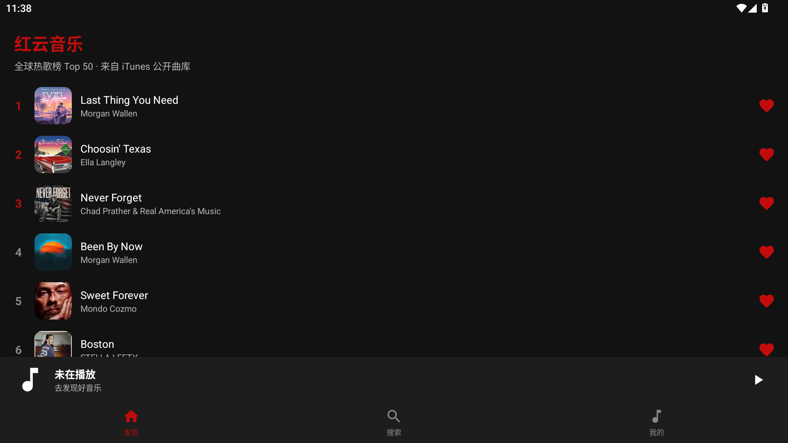
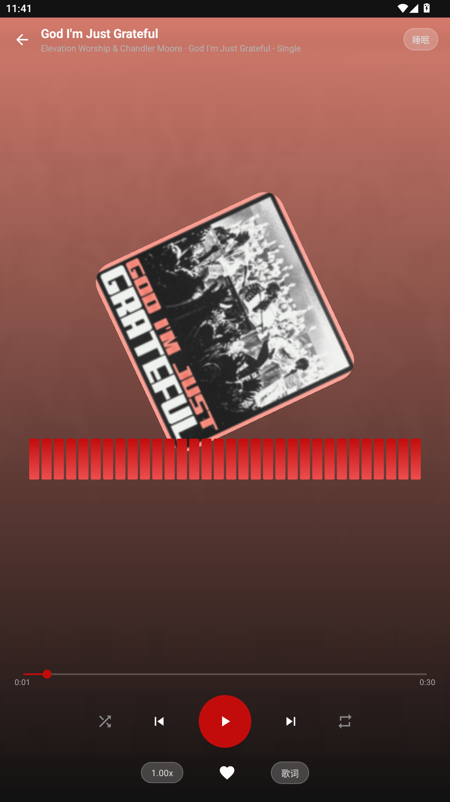
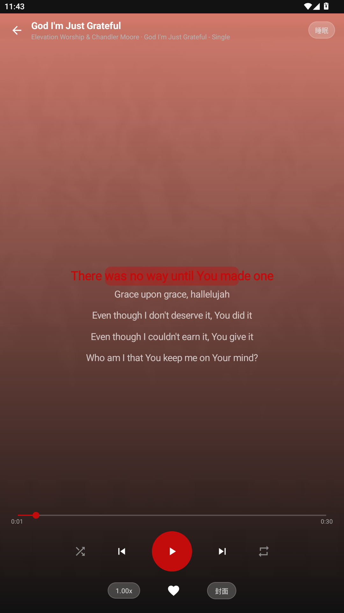
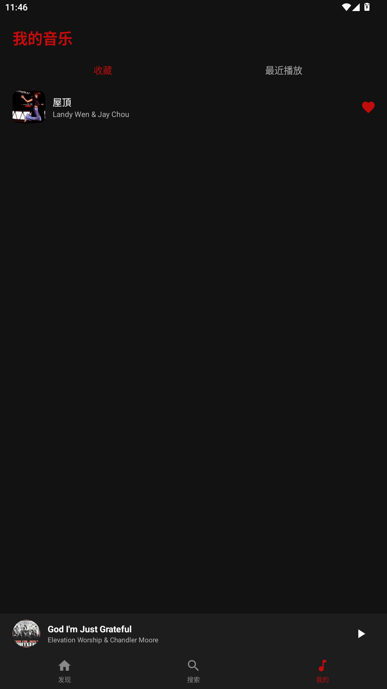

# 红云音乐 RedMusic

一款参考网易云音乐交互标准开发的安卓音乐播放器，自动联网拉取公开音乐源，支持封面、歌词、频谱动效、收藏与搜索。

## 功能特性

- 🎵 **在线音乐源**：自动从公开接口拉取歌曲、封面、歌词
- 🖼️ **封面展示**：专辑封面加载与缓存（Glide）
- ▶️ **完整播放 UI**：播放页、进度条、播放/暂停/切歌、循环/随机
- 📝 **滚动歌词**：逐行动态高亮的歌词显示
- 🌈 **频谱动效**：播放页实时频谱动画
- ❤️ **收藏夹**：本地收藏喜欢的歌曲
- 🔍 **搜索**：按关键词搜索音乐

## 技术栈

| 组件 | 用途 |
|---|---|
| Java 17 + Android Gradle Plugin 8.2.2 | 开发与构建 |
| ExoPlayer 2.18.7 | 音频播放 |
| OkHttp 4.12 | 网络请求 |
| Glide 4.16 | 图片加载 |
| Material / AppCompat | UI 组件 |

## 运行环境

- Android 7.0 (API 24) 及以上
- 支持 arm64-v8a / armeabi-v7a / x86_64 / x86 全架构（纯 Java 实现，无 native 库）
- 需要网络权限（自动获取音乐源）

## 构建方法

```bash
# 需要 JDK 17 + Android SDK
gradle assembleRelease
# 产物: app/build/outputs/apk/release/app-release-unsigned.apk
```

## 项目结构

```
app/src/main/java/com/redmusic/player/
├── api/          # 网络接口（ApiClient、MusicApi）
├── model/        # 数据模型（Track、LyricLine）
├── player/       # 播放核心（PlayerHolder）
├── ui/           # 界面（主界面、播放页、首页、搜索、收藏、歌词、频谱、迷你播放条）
└── util/         # 工具（Prefs）
```

## 截图

| 首页 | 播放页 | 歌词 | 收藏 |
|---|---|---|---|
|  |  |  |  |

## 免责声明

本项目仅用于技术学习与交流，音乐内容来源于公开网络接口，版权归原作者所有。
